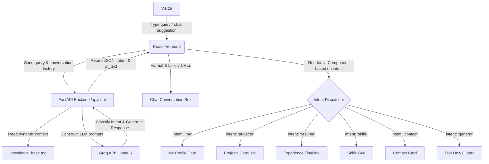

# AI-Powered Interactive Portfolio

An interactive, responsive portfolio website that uses an AI assistant to adapt dynamically to visitors' questions. Instead of presenting a static page, the website uses a FastAPI backend powered by Llama 3 to classify user intents and inject interactive, custom-designed widgets (like project carousels, experience timelines, and skill cards) directly into the chat interface.

---

## System Architecture

The following flowchart explains how queries flow from the frontend to the backend, compile context from the dynamic knowledge base, and render customized UI widgets:



---

## Core Features

### 1. Interactive Landing Page
* **WebGL Fluid Cursor Background**: Premium and lightweight interactive fluid cursor background shader built using WebGL for a modern, fluid visual aesthetic.
* **Floating Prompt suggestions**: Staggered, interactive search suggestions (`Me`, `Projects`, `Experience`, `Skills`, `Contact`) that animate on hover and guide visitors to interact with the chatbot.

### 2. Conversational Memory & Context
* **Multi-Turn Chat History**: The frontend automatically tracks and appends conversation history to outgoing API calls, allowing the AI to understand contextual follow-up questions (e.g., asking *"What projects did you build?"* followed by *"Show me the code for the first one"*).
* **Dynamic Markdown Knowledge Base**: The AI assistant references a standalone Markdown document (`backend/knowledge_base.md`) for all personal details, making it simple to edit your biography, experience, and project info without changing source code.

### 3. Smart Intent Classification
* **Adaptive UI Rendering**: The AI assistant classifies the user's intent to display rich interactive components (like a timeline or carousel) alongside its text replies.
* **Layout Optimization**: Differentiates between overview queries (renders the visual carousel) and specific follow-up queries (renders text-only output) to avoid duplicate visual lists cluttering the conversation.

### 4. Interactive Experience Timeline
* **Status Badges**: Experience cards feature rotating status indicators (sync/refresh icon for ongoing roles, static checkmark for completed roles).
* **Slider Graphics**: Sleek horizontal timeline slider bars displaying the start/end periods of each position.
* **Rich Descriptions**: Structured bullet-point mapping displaying key achievements.

### 5. Clickable Text Links (Linkification)
* The chat box parses URLs dynamically and displays them as clean, clickable anchors opening in new browser tabs. It correctly isolates trailing punctuation (like periods at the end of sentences) so links do not break.

---

## Directory Structure

```text
my-portfolio/
├── backend/
│   ├── main.py              # FastAPI server, intent parsing, and Groq client
│   ├── knowledge_base.md    # Markdown knowledge source for the AI
│   └── requirements.txt     # Python dependencies
└── frontend/
    ├── public/              # Static assets (Memojis, screenshots)
    ├── src/
    │   ├── components/      # UI components (FluidCursor, ExperienceTimeline)
    │   ├── data/            # Static data files (skills.ts, projects.ts, experience.ts)
    │   ├── App.tsx          # Main layout and chat container
    │   └── main.tsx         # React entrypoint
    └── tsconfig.json        # TypeScript configuration
```

---

## Getting Started

### Prerequisites
* **Node.js**: v18 or higher
* **Python**: v3.10 or higher
* **Groq API Key**: Needed for the backend LLM completions

---

### Running the Backend

1. Navigate to the backend directory:
   ```bash
   cd backend
   ```
2. Create and activate a Python virtual environment:
   ```bash
   python3 -m venv venv
   source venv/bin/activate
   ```
3. Install dependencies:
   ```bash
   pip install -r requirements.txt
   ```
   *(Note: Make sure to install `watchfiles` to enable fast, low-CPU file monitoring on macOS)*
   ```bash
   pip install watchfiles
   ```
4. Create a `.env` file in the `backend/` directory:
   ```env
   GROQ_API_KEY=your_groq_api_key_here
   ```
5. Start the FastAPI server:
   ```bash
   uvicorn main:app --reload --reload-exclude "venv"
   ```

The backend server will run locally at `http://127.0.0.1:8000`.

---

### Running the Frontend

1. Navigate to the frontend directory:
   ```bash
   cd frontend
   ```
2. Install dependencies:
   ```bash
   npm install
   ```
3. Start the Vite development server:
   ```bash
   npm run dev
   ```

The frontend application will be hosted locally at `http://localhost:5173`.
