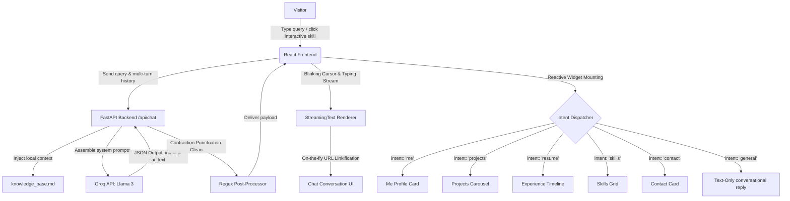

# AI-Agent Interactive Portfolio

An advanced, responsive portfolio website that operates as an **interactive AI assistant**, dynamically adapting its interface to answer visitors' questions about my work, experience, and background. 

Instead of showing a static CV, this architecture leverages a **FastAPI backend** powered by **Llama 3 (via Groq)** to perform real-time intent classification and dynamic component routing. The frontend automatically mounts rich interactive widgets (project carousels, experience timelines, skills grids, and contact cards) in sync with conversational AI replies.

---

## 🛠 System Architecture

The workflow below demonstrates how user messages compile with local grounding context and trigger reactive visual widgets:



---

## 🚀 Key Engineering Achievements

### 1. Dynamic UI Component Routing via Intent Classification
The backend LLM classifies the user's natural language into structured intents (`me`, `projects`, `resume`, `skills`, `contact`, `general`). The React client captures this intent dynamically and mounts corresponding stateful components (like a timeline or carousel) directly into the chat flow, bridging the gap between natural language interfaces and structured dashboard widgets.

### 2. Context Grounding (RAG-Lite)
The FastAPI server reads and injects a dynamic local Markdown knowledge source (`knowledge_base.md`) directly into the LLM system prompt on every request. This grounds the AI agent with verified data about my projects, stack, and history, ensuring **zero hallucinations** and keeping conversational replies highly accurate and relevant.

### 3. Client-Side Theme Interception
The chat input handler intercepts conversational layout requests. If a user types commands like *"turn on dark mode"* or *"switch to light theme"*, the frontend instantly updates the global document styles to support the pure-black background and responds with simulated typing text without wasting API requests or network latency.

### 4. Interactive Skills Ingestion
All skills rendered on the Skills Grid are interactive buttons. Clicking any skill dynamically builds and submits an automated prompt to the chat engine (e.g. *"Tell me about your experience with FastAPI"*), turning static tech stacks into active conversation starters.

### 5. Custom Typewriter Suggestion Hook
The search input features a custom [useTypewriterPlaceholder](file:///Users/vaibhavarya/Documents/Culture/my-portfolio/frontend/src/hooks/useTypewriterPlaceholder.ts) hook that runs a non-blocking loop, writing and erasing sample questions with a blinking terminal cursor (`|`). It utilizes React refs to prevent reference changes or component renders from resetting active timers.

### 6. Contraction Normalizer & Grammar Clean
To avoid syntax errors, LLMs formatted to output JSON values occasionally omit contraction apostrophes. The FastAPI server uses a python post-processor regex pipeline to automatically search, clean, and reconstruct proper punctuation (e.g. `Ive` $\rightarrow$ `I've`, `Im` $\rightarrow$ `I'm`, `dont` $\rightarrow$ `don't`) before returning payloads.

### 7. Uvicorn Reload Optimization
Running standard file-watching on project directories traverses python virtual environments and node modules, causing reloading speeds to take multiple seconds. By starting the server with `--reload-exclude "venv/*"`, reload times were reduced to under **100ms**.

---

## 📁 Directory Structure

```text
my-portfolio/
├── backend/
│   ├── main.py              # FastAPI server, regex cleanup, and Groq client
│   ├── knowledge_base.md    # Markdown database (LLM grounding source)
│   └── requirements.txt     # Python dependencies
└── frontend/
    ├── public/              # Static assets & Memojis
    ├── src/
    │   ├── components/      # UI components (FluidCursor, ExperienceTimeline)
    │   ├── hooks/           # Typewriter hooks & cursor listeners
    │   ├── data/            # Static data configurations
    │   ├── App.tsx          # Main layout & chat container
    │   └── main.tsx         # React entrypoint
    └── tsconfig.json        # TypeScript configuration
```

---

## 🛠 Getting Started

### Prerequisites
* **Node.js**: v18 or higher
* **Python**: v3.10 or higher
* **Groq API Key**: Needed for LLM completions

---

### Running the Backend

1. Navigate to the backend directory:
   ```bash
   cd backend
   ```
2. Create and activate a Python virtual environment:
   ```bash
   python3 -m venv venv
   source venv/bin/activate
   ```
3. Install dependencies:
   ```bash
   pip install -r requirements.txt
   pip install watchfiles
   ```
4. Create a `.env` file in the `backend/` directory:
   ```env
   GROQ_API_KEY=your_groq_api_key_here
   ```
5. Start the FastAPI server:
   ```bash
   uvicorn main:app --reload --reload-exclude "venv/*"
   ```

The backend server will run locally at `http://127.0.0.1:8000`.

---

### Running the Frontend

1. Navigate to the frontend directory:
   ```bash
   cd frontend
   ```
2. Install dependencies:
   ```bash
   npm install
   ```
3. Start the Vite development server:
   ```bash
   npm run dev
   ```

The frontend application will be hosted locally at `http://localhost:5173`.
