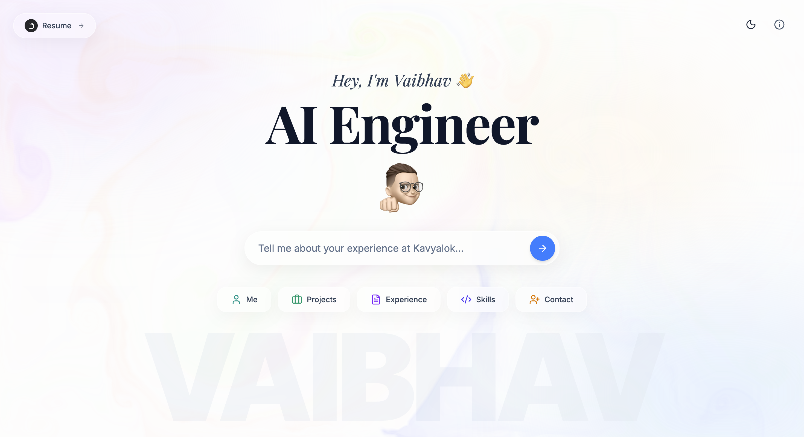
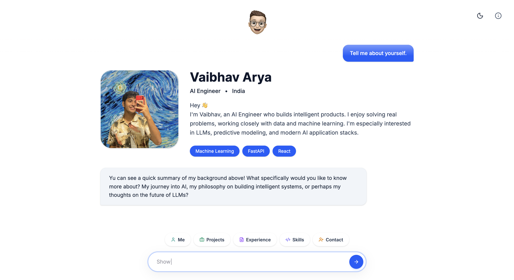
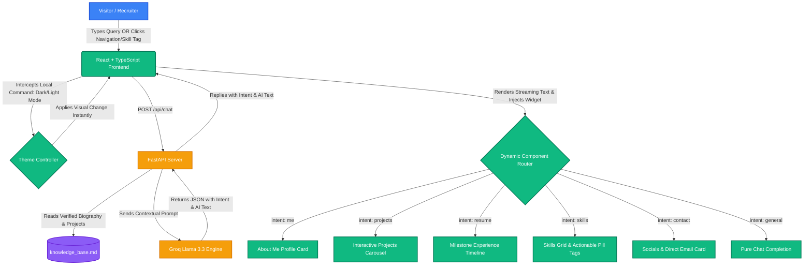

# AI Portfolio

An interactive, responsive portfolio website that operates as an **AI-powered personal agent**, dynamically adapting to answer questions about my work, skills, and background. 

Instead of a static PDF or traditional layout, this application acts as a conversational dashboard. Powered by a **FastAPI backend** and **Llama 3 (via Groq)**, it reads verified facts in real time and automatically embeds interactive visual UI widgets (project carousels, experience timelines, and skill grids) directly into the conversation stream to show recruiters exactly what they ask for.

---

## Interface Preview

Here is how the portfolio looks in action:

### 1. Landing View

*Interactive search interface with a custom real-time typewriter placeholder loop and cursor-responsive WebGL fluid simulation shader background.*

### 2. Conversational Dashboard View

*AI conversation screen displaying grounded facts combined with dynamic interactive component injection (such as projects carousel and experience timeline).*


---

## System Flow

The diagram below shows how visitor queries route through the grounded Llama 3 engine and trigger visual dashboard widgets dynamically:



---

## Core Features

### 1. Grounded AI Conversational Brain (No Hallucinations)
- **Verified Fact Base**: Grounded entirely by a local markdown file (`backend/knowledge_base.md`). The AI agent only answers with 100% factual details about my biography, work history, and stack, ensuring **zero hallucinations**.
- **Contextual Threading**: Features conversational follow-up memory, allowing visitors to ask natural questions like *"What projects did you build?"* followed by *"What is the tech stack of the first one?"*.

### 2. Semantic Intent-Driven UI Dispatcher
- The Llama 3 engine parses visitor questions and returns a structured JSON payload categorizing the user's intent.
- The frontend dynamically routes this intent, embedding full-featured interactive React widgets (such as a project carousel, job timeline, or skills list) directly in-line with the conversational response.

### 3. Interactive Experience Timeline
- Displays professional journey milestones utilizing custom status capsules, visual sliders, and structured impact metrics.
- Recruiter-oriented badges clearly separate active ongoing positions (like co-founding Kavyalok) from completed milestones.

### 4. Search Suggestion & Actionable Skill Tags
- **Framer Motion Nav Dock**: A spring-physics magnifying dock at the bottom of the screen provides quick navigation triggers.
- **Clickable Skill Tags**: Every skill badge behaves as a search shortcut. Clicking it automatically inputs a query to the chat (e.g. *"Tell me about your experience with FastAPI"*), prompting the AI to list the specific projects and history where that skill was applied.

### 5. Pitch-Black Glassmorphic Aesthetics
- **WebGL Fluid Simulation**: A lightweight WebGL shader canvas runs a interactive fluid simulation background that moves with the user's mouse cursor.
- **Tailwind Pure Black Theme**: Visual aesthetics built on a `#000000` pitch-black dark mode with zinc-toned borders, translucent glassmorphism, and responsive theme transitions.

---

## 📂 Project Directory Structure

```text
my-portfolio/
├── backend/
│   ├── main.py              # FastAPI server, intent parser, and regex post-processors
│   ├── knowledge_base.md    # Markdown database (grounded facts)
│   └── requirements.txt     # Python backend dependencies
└── frontend/
    ├── public/
    │   └── assets/
    │       ├── me/          # Avatar/profile pictures
    │       ├── memoji/      # Conversational Memoji state assets
    │       └── screenshots/ # Place screenshots here to embed in README
    ├── src/
    │   ├── components/      # UI components (FluidCursor, ExperienceTimeline, etc.)
    │   ├── hooks/           # Suggestion hooks & WebGL shader bindings
    │   ├── App.tsx          # Main React layout, state, and chat core
    │   └── main.tsx         # React compiler entrypoint
```

---

## Getting Started

To run this project locally, follow the steps below:

### Prerequisites
- **Node.js**: v18.0 or higher
- **Python**: v3.10 or higher
- **Groq API Key**: (Get one for free at [console.groq.com](https://console.groq.com/))

### 1. Set Up the Backend Server

1. Navigate to the backend directory:
   ```bash
   cd backend
   ```
2. Create and activate a Python virtual environment:
   ```bash
   python3 -m venv venv
   source venv/bin/activate
   ```
3. Install dependencies:
   ```bash
   pip install -r requirements.txt
   pip install watchfiles
   ```
4. Create a `.env` file in the `backend/` directory and add your API key:
   ```env
   GROQ_API_KEY=your_groq_api_key_here
   ```
5. Start the FastAPI server:
   ```bash
   uvicorn main:app --reload --reload-exclude "venv/*"
   ```
The backend server will spin up at `http://127.0.0.1:8000`.

### 2. Set Up the Frontend Dev Server

1. Open a new terminal window and navigate to the frontend directory:
   ```bash
   cd frontend
   ```
2. Install the React packages:
   ```bash
   npm install
   ```
3. Launch the local development server:
   ```bash
   npm run dev
   ```

The frontend application will be hosted locally at `http://localhost:5173`.
